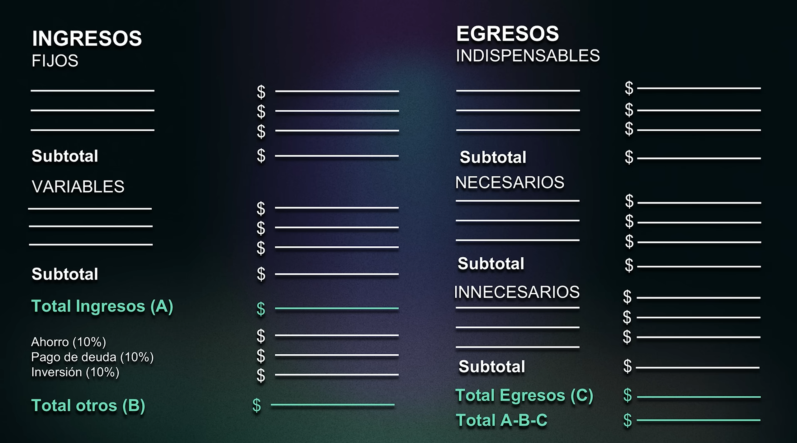
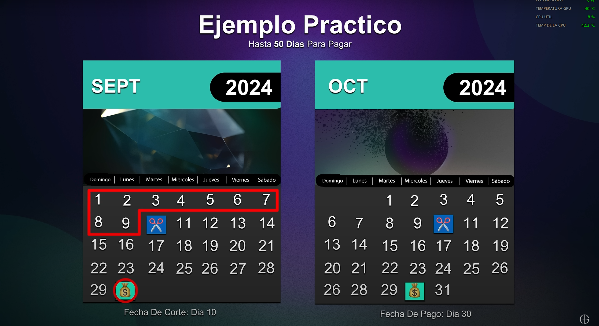
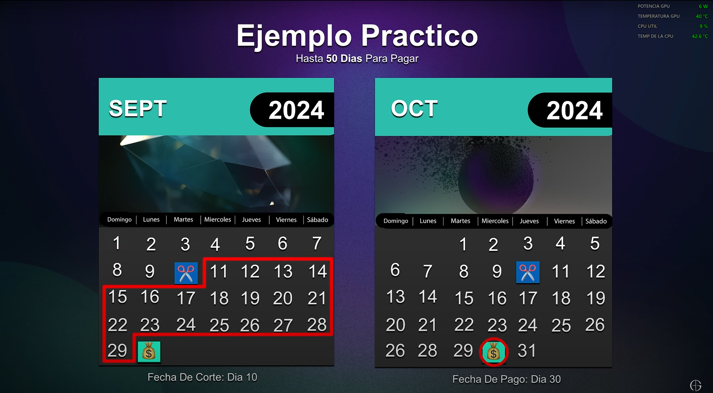
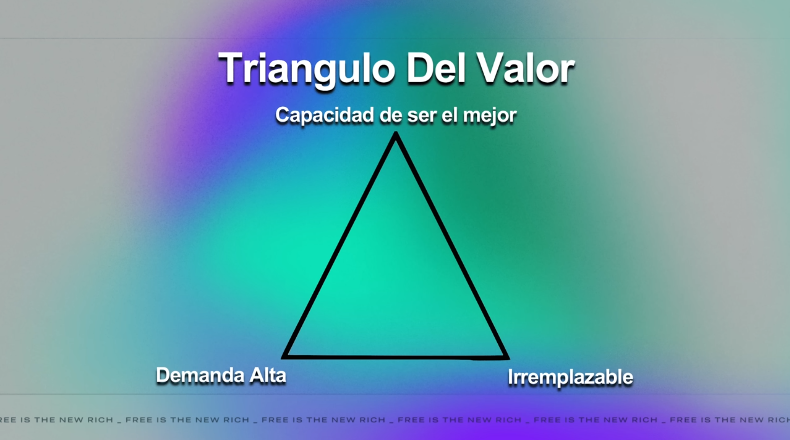
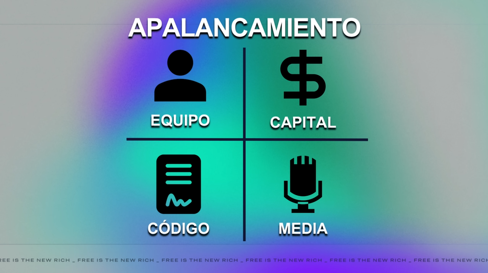

# Fiel en lo poco, fiel en lo mucho. Masterclass de educación financiera con Andrés Garza
#Resumen #Conferencia #DesarrolloPersonal 
# Puntos destacados
- Tu situación actual **no es** tu destino final.
- Hay que aprovechar que nuestros errores son más baratos ahora (a temprana edad) para aprender.
- La verdadera libertad requiere asumir **responsabilidad**.
- Los **hábitos** que desarrollemos definen nuestro futuro.
- El **cuestionamiento** es fundamental para el **crecimiento**.
- El **dinero** es un *intercambio de valor*.
- El **conocimiento** es el único activo que nadie puede quitarte.
- Una buena gestión de riesgos no es evitarlos, sino <mark>conocer qué riesgos estás tomando</mark>.
- **No existe** el dinero fácil, rápido y seguro.
- Mientras no hagas consciente lo inconsciente, lo inconsciente dominará tu vida y le llamarás destino.

# Introducción
## Tu situación actual
Generalmente nos negamos a aprender sobre finanzas porque creemos que lo que hagamos ahora no tendrá un impacto importante en el futuro; pero lo tendrá. Si no sabemos administrar $100, mucho menos podremos administrar $1 000 000.

Es inevitable cometer errores al aprender a manejar el dinero, mas los errores que cometamos ahora serán más baratos que cuando tengamos más dinero. Si aprendemos ahora, estaremos preparados para cuando venga más.

## Tu impacto hoy
¿Para qué hago esto si no tiene impacto ahora? Los hábitos que creamos ahora, definen nuestro futuro.

## Definición del éxito
Creemos que el éxito se suele atribuir a una sola acción; no obstante, se debe a todo lo que hubo detrás para que dicha acción sucediera. Esto es similar a lo que mencionó James Clear en su libro [Hábitos Atómicos](https://github.com/AntonioLive8166GameDev/Resumen-de-Habitos-Atomicos/blob/main/Resumen.md).
> Los grandes hitos con frecuencia son el resultado de muchos acontecimientos previos que acumulan el potencial requerido para desencadenar un gran cambio.

## ¿Qué es el dinero?
El **dinero** es un *intercambio de valor*. El dinero simplemente se transmite.

## La historia de Charles P. Steinmetz
Te pagan por lo que ayudas con lo que sabes; *ergo*, si se continúa con el aprendizaje, podremos otorgar más valor al mundo y ser recompensados por ello.

## Tus finanzas
> Si no sabes administrar $100, nunca podrás administrar $100,000,000.

# Fundamentos y estrategias
## El presupuesto
El **presupuesto** es un plan para ordenar tu dinero <mark>antes de recibirlo</mark>.

> Todo el mundo tiene un plan para sacarte dinero, y si tú no tienes un plan para mantenerlo, eres parte del plan de alguien más.

### ¿Cómo hacer un presupuesto?
1. ***Apunta*** todos tus gastos.
	*Lo que no se mide, no se mejora*. Esta información nos permitirá tomar mejores decisiones.
	
2. ***Compara*** tus **ingresos** y **egresos** e identifica tu balanza ($ingresos - egresos$). 
	Existen tres posibles escenarios:
	1. Tus ingresos son menores que tus gastos. <mark>Te estás endeudando</mark>.
	2. Tus ingresos y gastos son iguales.
	3. Tus ingresos son mayores que tus gastos. <mark>El estado financiero adecuado</mark>.
	
3. ***Clasifica y prioriza*** tus gastos.
	Los gastos se clasifican en tres tipos:
	1. Indispensables.
		Estos son **no negociables**, como la vivienda y la alimentación.
	2. Necesarios.
		Podemos vivir sin ellos, mas siguen siendo importantes. Pueden ser aquellos que te enriquezcan en ámbitos no económicos, como tu imagen personal.
	3. No necesarios.
		Gastos hormiga, salidas caras, etc. Gastos que no son importantes en lo absoluto.
	
4. ***Establece un objetivo***. ¿Qué deseas lograr?
	Se trata de metas financieras que traerán un beneficio en el largo plazo, como la adquisición de un vehículo o un viaje, para justificar el sacrificio que deberás hacer en el presente para lograrlo.

### Estructura de un presupuesto
 Un presupuesto se ve de la siguiente manera:

- **Ingresos fijos**: Dinero que obtienes mensualmente, como tu salario.
- **Ingresos variables**: Dinero que obtienes y puede variar, como una beca o un apoyo de tus padres.
- **Otros**: El dinero destinado a los objetivos que estableciste en el cuarto punto de la sección anterior.
- **Egresos**: Tus tres tipos de gastos.
- **Total A-B-C**: La diferencia entre tus ingresos totales (A) y la suma del total otros (B) y de egresos (C).

Al realizar esta resta (A - B -  C) hay tres posibles resultados:
1. <mark>Negativo</mark>. Recorta gastos innecesarios.
2. <mark>Neutral</mark>. Es justo como debe ser.
3. <mark>Positivo</mark>. Sobra para invertir.

## Los productos financieros
Los [productos financieros](../Productos%20financieros.md) son instrumentos que dan la posibilidad de obtener un rendimiento del dinero a través del ahorro e inversión y, generalmente son emitidos por instituciones financieras o bancarias.

> Necesitas dominar el juego para poder salir de él.

### Tarjetas de débito
Esta es simplemente una cuenta de ahorro, aunque hay algunas plataformas como NU, DINN, entre otras que te ofrecen un rendimiento en tus cuentas de débito.

### Tarjetas de crédito
Estas no deben verse como una extensión de tus ingresos, de lo contrario, puedes endeudarte. Solo gasta lo que ya tienes. Un mal uso de esta puede cambiar tu categoría en el [buró de crédito](../Buró%20de%20crédito.md).

#### Peligros
- Intereses (no los pagarás siempre y cuando pagues a tiempo).
- Endeudamiento. Atrasarse con los pagos.
- Interés compuesto.
- Dañar tu [historial crediticio](../Historial%20crediticio.md).

#### Beneficios
- *Cashback*.
- Puntos.
- Recompensas.
- Mejorar tu historial crediticio.

#### Fechas críticas
##### Fecha de corte
Es la fecha en la que el banco finaliza el registro de movimientos.

##### Fecha de pago
Fecha en la que se debe pagar lo acumulado hasta la fecha de corte. Esta fecha es la **fecha límite** de pago, por lo que puedes (y es recomendable) hacer tu pago con anticipación. Incluso algunas tarjetas permiten la automatización de dicho pago.

##### Ejemplo

Todo lo que compres antes del 10 de septiembre, deberás pagarlo el 30 del mismo mes.

Por otro lado, lo que compres después del 11 de septiembre hasta el 10 de octubre, deberás pagarlo hasta el 30 de octubre, no de septiembre; es decir, tendrás un plazo de hasta 50 días para pagar.

#### Pago mínimo
Pago necesario para no dañar el historial crediticio, es un porcentaje del total que debes. Genera intereses, evitar en la medida de lo posible.

#### Pago para no generar intereses
(Recomendado). Lo necesario para no endeudarse.

### Inversiones
>La mejor inversión que puedes hacer es en ti mismo. El conocimiento es el único activo que nadie puede quitarte.

Las inversiones no generan riqueza, **elevan exponencialmente** la que tú vas construyendo.
En las inversiones existen dos grandes mercados...

#### Renta fija
Se tiene una garantía de un rendimiento definido desde el principio.
Algunos instrumentos que pertenecen a la renta fija son:
- **CETES**. Estos son la forma más segura de invertir en México, pues están respaldados por el Gobierno.
- **Pagarés**.
- **Bonos**.
#### Renta variable
Se trata de inversiones <mark><strong>cuyo rendimiento no está garantizado</strong></mark>.
Algunos instrumentos que pertenecen a la renta variable son:
- **Acciones**. Son pequeños pedazos de compañía que podemos comprar.
- **Fibras**.  Son fideicomisos de infraestructura y bienes raíces.
- **ETFs**. Son paquetes (índices) de acciones que puedes adquirir para estar más diversificado.
- **Criptomonedas**. A diferencia de las otras tres, las criptomonedas son un mercado *no regulado*; al ser un tipo de moneda, no poseen valor debido a que no generan flujos, pero sí tienen un precio. Por otro lado, las acciones, fibras y ETFs son activos que pueden tener un valor, generan ingresos y puedes calcular su [valor intrínseco](../Valor%20intrínseco.md).

##  Dinero fácil
No existe el dinero fácil, rápido y seguro. Es imposible que estas tres condiciones se cumplan a la vez. 

## El triángulo de valor
Cualquier actividad económica que debas ejecutar, debe de cumplir con estos tres principios:

El dinero es un intercambio de valor. Asegúrate de que tus acciones estén dirigidas a un público donde tengan una alta demanda, de tener un valor humano que nadie más pueda ofrecer, y de ser el mejor dentro de tu público objetivo.

## Apalancamiento
El apalancamiento es hacer más con lo que ese siente se tiene actualmente. Debes colocar tu trabajo en lugares donde se aprecie más.

- **Equipo**. Si tienes a un equipo que te ayude con tus tareas, reducirás tu carga de trabajo.
- **Capital**. Al invertir más capital, obtendrás mejores resultados.
- **Código**. Invierte en herramientas que faciliten tu flujo de trabajo y el de tu equipo
- **Media**. Da a conocer tu trabajo.

# Bibliografía
- Andrez Garza. (6 de octubre de 2024). *CURSO Completo de FINANZAS PERSONALES | Andrés Garza* \[Archivo de video]. YouTube. https://www.youtube.com/watch?v=UhzdeGjLJ78&t=403s
